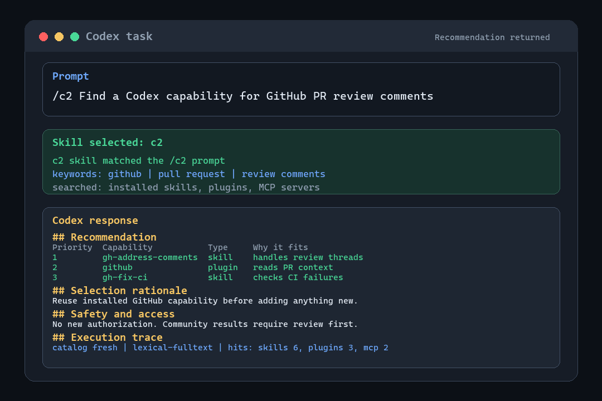
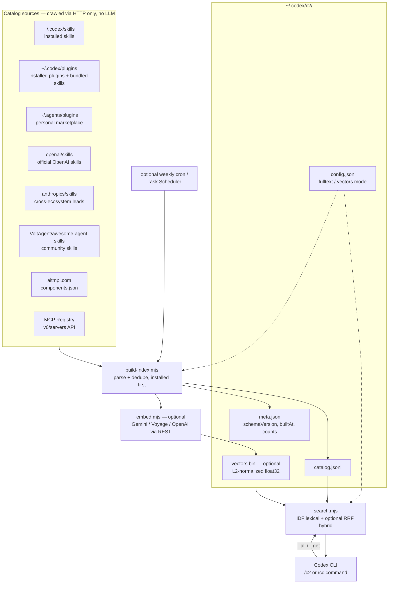
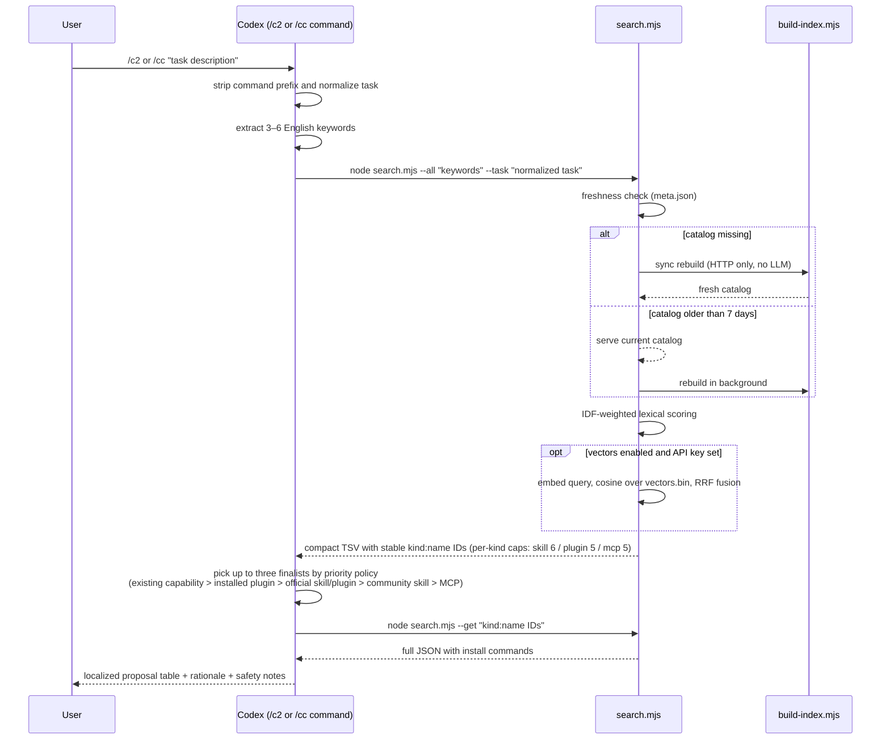

# c2 — Codex Concierge

> **Don't reinvent the wheel.** The Codex ecosystem already ships skills, plugins, and MCP servers — including the ones already installed on your machine. The hard part isn't building your own — it's knowing what already exists. c2 checks *before* you build.

**/c2** (or the short alias **/cc**) tells you the best combination of Codex **skills, plugins, and MCP servers** for whatever task you describe — using a **local RAG catalog** so that each recommendation costs almost zero tokens.

```
/c2 Find a Codex capability for GitHub PR review comments
/cc Find a Codex capability for GitHub PR review comments
```

→ Returns a prioritized proposal table (what to reuse, what to add, what *not* to add) with ready-to-run install commands and a visible search trace.

The plugin ships Codex command prompts in `plugins/c2/commands/`: `/c2` is the primary command, and `/cc` is an alias that runs the same workflow.

Command behavior is intentionally quiet and predictable:

- `/c2` and `/cc` strip the command prefix before searching, so the command name itself does not match the c2 plugin.
- Intermediate search chatter is kept out of the conversation unless something is blocked or slow.
- The final recommendation follows the user's language when practical; machine trace lines stay verbatim for auditability.

## Demo



## Why

c2 is a Codex port of its Claude Code sibling [happygoluckydev/c3](https://github.com/happygoluckydev/c3): every time you're about to hand-roll a skill, plugin, or MCP integration, something in the ecosystem — or already sitting in `~/.codex/skills` and `~/.codex/plugins` — has probably solved it already. Reuse beats rebuild, which is why c2's recommendation policy literally starts with *"no addition needed — reuse what you already have."* The catalog indexes your own installed skills and plugins first.

But checking the ecosystem by hand (or letting the model web-research it) costs real time and a lot of tokens per question. c2 splits the work:

| Phase | Frequency | Cost |
|---|---|---|
| **Crawl** — build `~/.codex/c2/catalog.jsonl` from public sources | on first use; then when stale (>7 days), in the background | HTTP only, no LLM calls |
| **Retrieve** — IDF-weighted keyword search over the catalog | every request | milliseconds, zero API cost |
| **Propose** — Codex synthesizes the combination | every request | a few thousand tokens |

Default path: no embedding API, no npm dependencies — Node.js standard library only. Optional vector search adds a REST embedding call (still no npm packages).

## How it works

### Architecture



### Query flow



## Catalog sources

- Your already-installed skills and plugins (`~/.codex/skills/`, `~/.codex/plugins/`) — reuse comes first
- Your personal plugin marketplace (`~/.agents/plugins/marketplace.json`)
- [openai/skills](https://github.com/openai/skills) — official OpenAI skills
- [anthropics/skills](https://github.com/anthropics/skills) — cross-ecosystem discovery leads; Claude-specific entries are leads to review and adapt, not directly installable Codex plugins
- [VoltAgent/awesome-agent-skills](https://github.com/VoltAgent/awesome-agent-skills) — vendor and community skills
- [aitmpl.com](https://github.com/davila7/claude-code-templates) components catalog — community skill templates
- [Official MCP Registry](https://registry.modelcontextprotocol.io) — active public MCP servers; inclusion in the official registry does not mean the publisher itself is official

Source counts depend on the live upstream catalogs and the user's installed Codex environment. Add sources by editing `plugins/c2/skills/c2/scripts/build-index.mjs` (one function per source).

Catalog builds a local search index on your machine. In default fulltext mode, that local `catalog.jsonl` can include names, tags, descriptions, and clipped body text from installed skills/plugins and selected public skill sources (up to 4,000 chars per entry); `"fulltext": false` skips body indexing. That does **not** re-license those upstream projects — each skill, plugin, or MCP server remains under its own license and terms. c2 points you at candidates; you still follow each project's license when you install or reuse it.

### Entry metadata and audit trace

Every catalog entry uses schema version 2 and includes provenance and safety fields in addition
to its searchable name, tags, and description:

| Field | Purpose |
|---|---|
| `sourceClass` | `official`, `community`, or `unknown` publisher provenance |
| `license` | SPDX identifier when the source provides one; otherwise `unknown` |
| `maturity` | `stable`, `experimental`, `deprecated`, or `unknown` |
| `distribution` | `built-in`, `installed`, `installable`, `copy-and-adapt`, or `unknown` |
| `surface` | One or more applicable surfaces, or `unknown` when the source cannot establish them |
| `parentPlugin` | Owning plugin name for a bundled component; otherwise `null` |
| `permissions` | Declared access classes when known; otherwise `unknown` |

Unknown values are intentional: c2 does not infer a license, safety boundary, or maturity level
from a repository name or a marketplace listing. `search.mjs --all` emits a machine-generated
trace with the execution time, catalog schema, catalog build time, query tokens, and result counts.
`--get` emits a separate trace on stderr with the requested and matched records, so a response
never needs to invent a `# get:` line.

Publisher provenance and installation state are separate. For example, an installed capability
uses `distribution: "installed"`, while `sourceClass` remains `official`, `community`, or
`unknown`. MCP Registry lifecycle values such as `active` are not publisher verification, so
registry entries remain `sourceClass: "unknown"` unless a dedicated verification signal exists.

`--all` returns a stable `id` column in `kind:name` form. Pass those IDs to `--get`; a bare name is
accepted only when it identifies exactly one catalog record.

## Install

**Prerequisites**: [Node.js](https://nodejs.org/) (for catalog build/search) and the [Codex CLI](https://developers.openai.com/codex) with plugin support.

```sh
git clone https://github.com/happygoluckydev/c2.git
```

Add the cloned `plugins/c2` directory through the Codex Plugins workflow (or reference it from a personal `~/.agents/plugins/marketplace.json` entry). This makes the `c2` skill plus the `/c2` and `/cc` command prompts available. Start a new Codex session, then run `/c2 <task>` or `/cc <task>`.

### Install options

The catalog defaults to fulltext lexical search with no external services. To change modes, create or edit `~/.codex/c2/config.json`:

```json
{
  "fulltext": true,
  "vectors": { "provider": "openai" }
}
```

| Setting | Effect |
|---|---|
| `"fulltext": true` (default) | Lexical search including document bodies. Zero external services. |
| `"fulltext": false` | Lite: skip body indexing — catalog roughly half the size, slightly lower recall. |
| `"vectors": { "provider": "openai" \| "gemini" \| "voyage" }` | Hybrid search: lexical + embedding ranks fused with RRF. Needs `OPENAI_API_KEY` / `GEMINI_API_KEY` / `VOYAGE_API_KEY`. Embedding cost is small per full rebuild; queries are one embed call each. |

If the configured provider's API key is missing or a request fails, search falls back to lexical mode.

#### Optional vector search: what leaves your machine

Default install is **local-only** (lexical / fulltext). With `vectors` enabled, the chosen provider receives:

- **Catalog rebuild**: names, tags, and descriptions for embedding (not fulltext bodies)
- **Each `/c2` or `/cc` query**: the search query string (keywords / task text) for one embed call

API keys stay in your environment variables. Review the provider's terms and data policies before enabling. For confidential task text, keep the default lexical mode (no external embed calls).

## Keeping the catalog fresh

On `/c2` or `/cc`, `search.mjs` builds the catalog synchronously if it is missing. If it exists but
is older than 7 days, or its schema version differs from the current implementation, the current
catalog is used immediately and a rebuild starts in the background (HTTP only, no LLM). Legacy
entries receive conservative `unknown` metadata while that rebuild is in progress.

To refresh on a fixed schedule instead:

```sh
sh plugins/c2/setup-schedule.sh      # macOS/Linux: weekly cron job (Mon 09:00)
```

```powershell
./plugins/c2/setup-schedule.ps1      # Windows: weekly scheduled task (Mon 09:00)
```

## Recommendation policy

Proposals follow a strict priority order (see `plugins/c2/skills/c2/SKILL.md`):

1. **No addition needed** — existing Codex capabilities or already-installed skills/plugins win
2. **Installed plugins** — maintained bundles already available in this Codex environment
3. **Official skills/plugins** — procedural knowledge alone is enough; official sources preferred
4. **Compatible community skills** — reviewed and adapted to fill a real gap
5. **MCP servers** — only when external data or action is truly essential (they cost resident context)

Community-made definition files can carry prompt-injection risks — c2 always reminds you to read them before installing.

### Optional: prune unused skills

If you want to inventory unused installed skills and estimate resident context cost:

```sh
node plugins/c2/skills/c2/scripts/prune.mjs           # dry-run report
node plugins/c2/skills/c2/scripts/prune.mjs --apply    # archive unused to ~/.codex/skills-archive/
```

This never deletes skills, only moves them. Archiving is refused when no Codex session transcript is available, because usage cannot be determined safely.

## 日本語

**「車輪の再発明をしたくない」から生まれたツールです。** Claude Code 向けの姉妹プロジェクト [c3](https://github.com/happygoluckydev/c3) の Codex 移植版です。自作のスキルやプラグイン、MCP 連携を書き始める前に、エコシステムに——あるいは手元の `~/.codex/skills` や `~/.codex/plugins` に——既にあるものを探して提案します。タスクを伝えると「追加不要（手元の資産の再利用）→ インストール済みプラグイン → 公式スキル/プラグイン → コミュニティ製スキル → MCP」の優先順で最適な組み合わせを提案する Codex スキルです。

クロールは HTTP のみ（LLM 不使用）。ローカル RAG カタログが無い初回は同期構築、7 日超で古い場合は手元のカタログで即応答しつつバックグラウンド再構築します。提案時の検索はローカルのみなのでクレジット消費を最小化できます。導入は `plugins/c2` を Codex の Plugins ワークフローから追加します。これで `c2` スキルと `/c2`・`/cc` の command prompt が使えるようになります。新しいセッションで `/c2 <やりたいこと>` または `/cc <やりたいこと>` を実行してください。

`/c2` と `/cc` はコマンド名を検索語から除外し、途中経過の説明を抑えて、可能な限りユーザーの言語で最終提案を返します。

MIT は **本リポジトリのコード／ドキュメントのみ**に適用されます。カタログが指す第三者のスキル・プラグイン・MCP は各プロジェクトのライセンス・利用条件に従ってください。既定のローカル検索では、`catalog.jsonl` に名前・タグ・説明文に加えてスキル本文の一部（最大 4,000 文字）が保存される場合があります。ベクトル検索を有効にした場合、外部 Embedding API に送信されるのは名前・タグ・説明文とクエリで、fulltext 本文は送信されません。機密タスクでは既定のローカル検索を推奨します。

## Relationship to c3

c2 adapts the architecture of [happygoluckydev/c3](https://github.com/happygoluckydev/c3) to Codex. Claude-specific agents and slash commands are represented by Codex skills and plugins; cataloging, retrieval, vector search, maintenance, and explanation features are provided in Codex-native form. Distributions that include material derived from c3 must retain the applicable c3 MIT copyright and license notices.

## License

[MIT License](./LICENSE) (`SPDX-License-Identifier: MIT`)

Copyright holder: see [AUTHORS](./AUTHORS) (`Copyright (c) 2026 happygoluckydev` in `LICENSE`). Author: [happygoluckydev](https://x.com/happyg01uckydev).

The MIT license covers **this repository's code and documentation only** — it does not grant rights to the skills, plugins, MCP servers, descriptions, or other content discovered through the catalog. Catalog entries are fetched directly from their respective sources at runtime and cached locally in `~/.codex/c2/`; they are not bundled in this Git repository. Each source, skill, plugin, and MCP server may have its own license, terms of use, attribution requirement, or commercial-use restriction — review those terms before installing, copying, redistributing, or using an entry in production. Some source catalogs are indexes rather than licensors of their listed content: a list's license does not replace the license of each listed skill, so treat all community entries as discovery leads until their original source and license have been reviewed.

Adding `plugins/c2` as a Codex plugin carries the notice with it via `plugins/c2/LICENSE`. Major scripts (`build-index.mjs`, `catalog.mjs`, `prune.mjs`, `search.mjs`, `setup-schedule.sh`, `setup-schedule.ps1`) carry an `SPDX-License-Identifier: MIT` header for machine-readable reuse.
